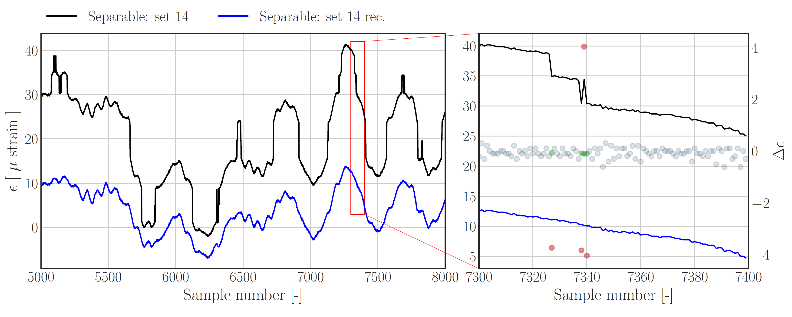
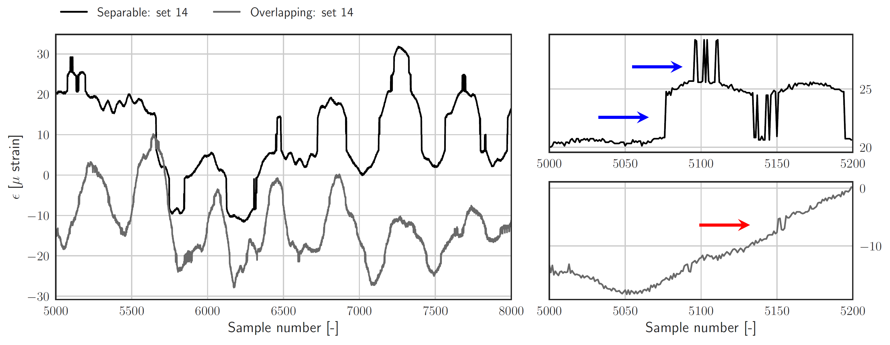
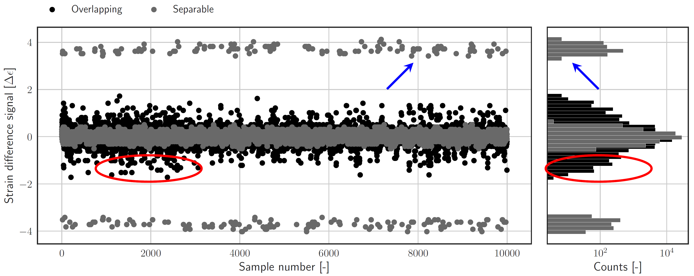

# py_peak_splitting

## Description
This package contains an implementation for the random telegraph noise (RTN) removal tools as outlined in: 

*__Multi-level RTN removal tools for dynamic FBG strain measurements corrupted by peak splitting artefacts__*

The aim of this project is to find a pragmatic but effective way to remove jumps which offset the signal over a certain 
amount of time, by a  certain amplitude. The article presents two methods which both follow the same principle: 

> __The problem of denoising a signal containing jumps is translated into detecting and  replacing outliers in the corresponding difference signal; once the outlier detection and replacement has been done, the cumulative sum of the de-noised difference signal is computed to arrive back at a de-noised version of the original signal__. 

A typical case of measurement data containing jumps can be seen in Figure 1, which shows a corrupted signal before 
(black) and after noise removal (blue). 

<center></center>
<center> Figure 1. Left: Raw signal before (black) and after removing RTN/peak-splitting artefacts (blue). Right: 
Zoom-in on smaller data subset, as well as corresponding difference samples with annotations for nominal samples 
(blue), outliers (red) and outlier replacements (green). Note that mean value of the de-noised signal has not been set 
to value which represents a realistic mean value of the raw signal. </center>


__For more detailed information on the two algorithms contained in this package, it is referred the accompanying 
publication, which can be read <ins>*here*</ins>__


## Background and motivation

Strain  measurements  using  Fiber  Bragg  (FBG)  optical  sensors  are becoming more and more popular. However, in some
 cases these measurements can become corrupted by sudden jumps in the signal, which offset the signal over the course 
of  e.g. several seconds. These jumps are caused by a defect in the FBG itself which is referred to as peak-splitting. 
The effects of peak-splitting artefacts on FBG strain measurements bear similarities with an additive multi-level 
telegraph noise process, in which the amplitudes and occurrences of the jumps are related to fiber deformation states. 

Jumps in measurement data, as shown in Figure 2, can severely limit the quality or usability of data. Figure 2 shows two 
raw signals with different levels of jump amplitudes relative to nominal difference between subsequent samples; the 
blue annotations indicate jumps which can be clearly separated from nominal samples, whereas the red annotations 
illustrate the case in which jump levels are not as straight forward to detect. The considered noise type cannot be 
removed by classical linear filters (e.g. a n'th order Butterworth filter). The presence of jumps in data motivates 
the need for a pre-processing tool which allows to effectively remove RTN noise.  


<center></center>
<center> Figure 2. Multi level telegraph noise / peak splitting artefacts. Left: two raw signals containing artefacts of 
different severity. Upper right:  large jump amplitudes in comparison with differences between subsequent signal 
samples. Lower right: jump amplitudes in same order of magnitude as difference samples. </center>

The principal idea presented in the accompanying publication is to translate the de-noising of the raw signal containing
 jumps, into the problem of de-noising a sample wise difference signal containing outliers. The latter is shown Figure 
3,  which also shows the corresponding histograms hinting at the distribution of the nominal and outlying difference 
samples. The blue and red annotations clearly indicate the outlying difference samples corresponding to relative large and 
small jumps respectively.

<center></center>
<center> Figure 3. Sample wise difference signals corresponding to signals presented in Fig. 2. The annotations high 
light outlying difference samples which are attributed to RTN / peak splitting artefacts. </center>

In order to de-noise the difference signal, an outlier detection scheme will be used to label difference samples 
corresponding to a jump in the data as an outlier.  After the outlier detection step, all outliers will be replaced by 
estimates. Once the de-noising process is completed, the cumulative sum is used to obtain a realization of the de-noised
 raw signal. If needed, the reconstructed signal can be corrected for a drift as well as a mean value, by maximizing 
the overlap between the raw and reconstructed signals. 


As mentioned, the accompanying article presents two methods which follow the outlined principle. Although sharing the 
underlying principle, they are different in the way they try to discriminate between nominal samples and outliers, as 
well  as in sample subset selection for the replacement of individual outliers. The first method is based on using a threshold 
filter for outlier detection; the high level working principle of the method is described as follows: 
- Compute the sample wise difference signal
- Derive an outlier threshold level from the histogram of difference samples
- Replace outliers in difference signal using a linear regression on an outlier specific buffer (which does not 
contain outliers).
- Take the cumulative sum 
- If necessary, apply drift and mean correction 

As an alternative to defining a single threshold based on the full signal, the second methods is aimed at defining 
threshold levels on shorter segments of the signal. The outlier detection step is based on a Hampel filter. The 
high-level working principle is outlined as follows: 
- Compute the sample wise difference signal
- Segment the data into short segments and compute segment wise threshold levels based on a scale estimate for the 
segment's standard deviation. 
- Perform outlier detection on individual segments 
- Replace outliers in segments using a linear regression (after removing outliers from segment).
- Take the cumulative sum 
- If necessary, apply drift and mean correction     

Basic use of both methods is outlined in section 1.4. A more elaborate demonstration can be found in the jupyter 
notebooks contained in '''./py_peak_splitting/demo/ ''' or using the Binder which can be found __*here*__.

## Installation requirements
py_peak_splitting is written for Python 3.6+. Downloading Anaconda3 is recommended for users not familiar with Python 
development. The numpy, scipy and matplotlib package are required to use all functionalities of the threshold filter 
based reconstruction method, which includes an option to visualise threshold levels and overlay a kernel density estimate.
The Hampel based reconstruction method only requires the numpy pacakage. 

The py_peak_splitting package can be installed using one of the methods listed below:

### Install using Pip (Recommended)
- Open a terminal or command line interface (or an anaconda prompt, if you're using anaconda) 
-  run: ```pip install py_peak_splitting ```
- The download and install should start


### Manual install
- Download or clone the package to a desired location on your machine
- Extract the zip file at that particular location  
- Open a terminal or command line interface (or an anaconda prompt, if you are using anaconda) 
- Set the current directory of the terminal/command line interface to the package's root: 
PATH_TO_PACKAGE_LOCATION/py_peak_splitting 
- run: ``` python install .setup.py```
- The installation should start

## Basic examples
This section contains the most basic usage examples. More elaborate examples are presented in a Binder which can be 
found *__here__*. For this section a dummy variable, ```a```, holding a 1-dimensional numpy array with corrupted 
measurements will be used:

```python
type(a) 
>> numpy.ndarray

a.shape
>> (60000,)
```

### Basic example Hampel filter based reconstruction methods: 
```python
from py_peak_splitting.hampel_filter import Hampel as Ha

h = Ha(a, th='sig', th_val= 3, re='plf', nperseg=50)
rec = h.reconstruction         
clu = h.clusters
lab = h.labels
```
###  Basic example Threshold filter based reconstruction methods: 

```python
from py_peak_splitting.th_filter import ThFilter as Th

th = Th(arr=a)  
thv = th.estimate_th(aggressive=True, th=500, plot=False)
rec, clu, lab = th.recon_th(th=thv, method='polyfit', nbuffer=25)
rec = rec.flatten()
```
# License
py_peak_splitting is licensed under a <a rel="license" href="http://creativecommons.org/licenses/by-nc-sa/4.0/">Creative Commons 
Attribution-NonCommercial-ShareAlike 4.0 International License</a>. Please check the license terms below and in the license file.

<a rel="license" href="http://creativecommons.org/licenses/by-nc-sa/4.0/"></a><br />

# Disclaimer
THIS SOFTWARE IS PROVIDED BY THE COPYRIGHT HOLDERS AND CONTRIBUTORS "AS IS" AND
ANY EXPRESS OR IMPLIED WARRANTIES, INCLUDING, BUT NOT LIMITED TO, THE IMPLIED
WARRANTIES OF MERCHANTABILITY AND FITNESS FOR A PARTICULAR PURPOSE ARE
DISCLAIMED. IN NO EVENT SHALL THE COPYRIGHT HOLDER OR CONTRIBUTORS BE LIABLE FOR
ANY DIRECT, INDIRECT, INCIDENTAL, SPECIAL, EXEMPLARY, OR CONSEQUENTIAL DAMAGES
(INCLUDING, BUT NOT LIMITED TO, PROCUREMENT OF SUBSTITUTE GOODS OR SERVICES;
LOSS OF USE, DATA, OR PROFITS; OR BUSINESS INTERRUPTION) HOWEVER CAUSED AND ON
ANY THEORY OF LIABILITY, WHETHER IN CONTRACT, STRICT LIABILITY, OR TORT
(INCLUDING NEGLIGENCE OR OTHERWISE) ARISING IN ANY WAY OUT OF THE USE OF THIS
SOFTWARE, EVEN IF ADVISED OF THE POSSIBILITY OF SUCH DAMAGE.
SOFTWARE, EVEN IF ADVISED OF THE POSSIBILITY OF SUCH DAMAGE.
